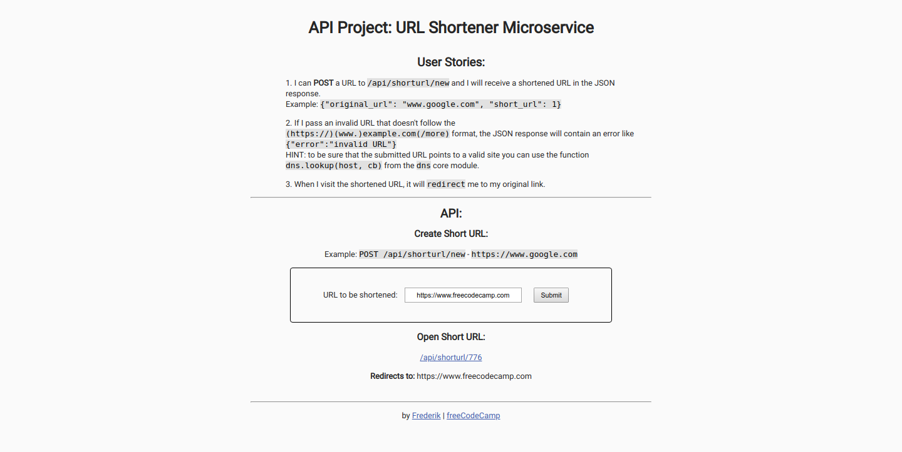

# URL Shortener

## Introduction
A URL gets converted to a shortened URL and saved to a database. Navigating to a shortend URL will redirect to the original URL.

This project is part of freeCodeCamps API And Microservices certificate.

***

## Project Requirements
* It is possible to POST a URL to `/api/shorturl/new` and a shortened URL in the JSON response gets returned. Example: `{"original_url":"www.google.com","short_url":1}`
* Passing an invalid URL that doesn't follow the valid `(https://)(www.)example.com(/more/routes)` format returns the JSON response containing an error like `{"error":"invalid URL"}`. *HINT*: to be sure that the submitted url points to a valid site, use the function `dns.lookup(host, cb)` from the `dns` core module.
* Visiting the shortened URL will redirect to the original link.

***

## Final Project
https://fcc-api-url-shortener-fred.glitch.me

***

## Behind the scenes
### Backend:
* Node
* Express
* Mongoose

### Database:
* MongoDB

### Hosting:
* Glitch
* mLab

***

## Preview Images
### Main Screen:

